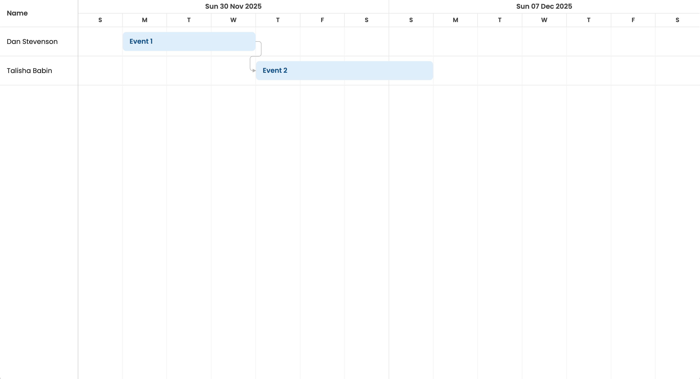

# How to connect a Bryntum Scheduler Pro project to a Dynamics 365 Field Service project

The code for the complete app is on the `completed-app` branch.

## Getting started

The starter repository uses [Vite](https://vitejs.dev/), which is a development server and JavaScript bundler. You’ll need Node.js version 20.19+ for Vite to work. 
Install the Vite dev dependency by running the following command: 

```sh
npm install
```

Install the Bryntum Scheduler Pro component by first following the [Using Bryntum NPM repository and packages](https://bryntum.com/products/schedulerpro/docs/guide/SchedulerPro/npm-repository) guide to access the private Bryntum repository. Then, install the component. If you have a Bryntum license, use the following command:

```sh
npm install @bryntum/schedulerpro 
```

If you're using a Bryntum trial license, use the following command:

```sh
npm install @bryntum/schedulerpro@npm:@bryntum/schedulerpro-trial
```

## Running the app

Run the local dev server using the following command:

```sh
npm run dev
```

You'll see a Bryntum Scheduler Pro with a two resources and two events that are dependent on each other:

